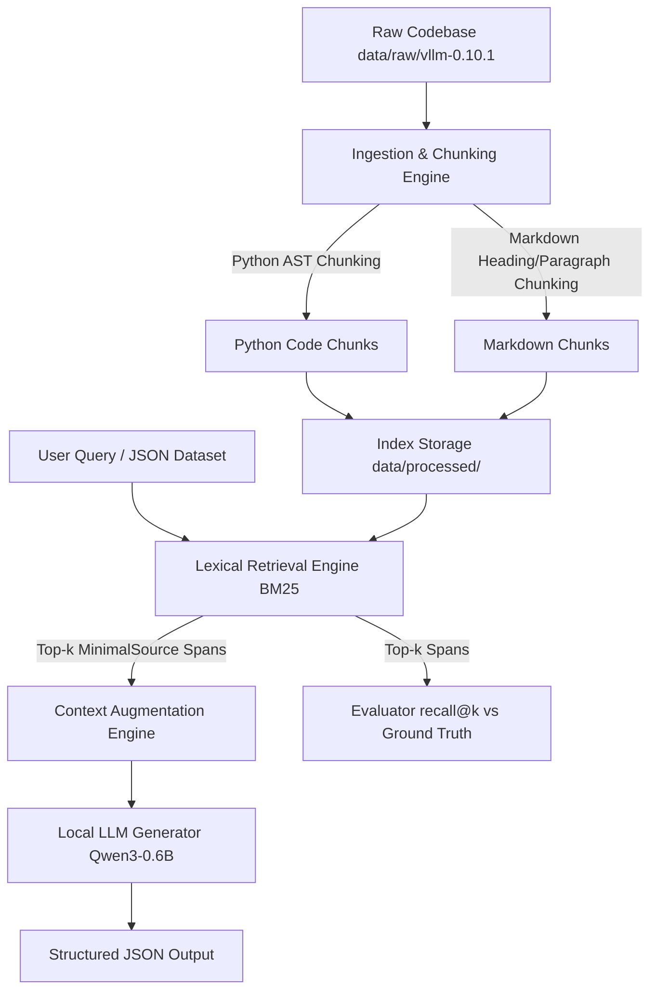

# RAG Against the Machine — Implementation Plan & Project Blueprint

## Project Overview
`RAG Against the Machine` is a production-grade Retrieval-Augmented Generation (RAG) system built in Python 3.10+ to perform intelligent search and question-answering over a target codebase (`vLLM`). It ingests Python code and Markdown documentation, chunks them using structure-aware strategies, indexes them using lexical search algorithms (BM25/TF-IDF), retrieves relevant snippets with high precision, and uses a local language model (`Qwen/Qwen3-0.6B`) to generate accurate, grounded answers.

---

## User Review Required
> [!IMPORTANT]
> **Environment & Dependency Manager:** The project mandates using `uv` for package management (`uv sync`).
> **Model Selection:** `Qwen/Qwen3-0.6B` is required as the default generation model.
> **Performance Targets:** Indexing < 5 mins for whole corpus; Retrieval throughput < 90s for 200 questions; Recall@5 >= 80% for docs, >= 50% for code.

---

## High-Level System Architecture & Workflow

---

## Detailed Requirements Extraction Matrix

| Requirement | Mandatory | Planned Phase | Notes & Specifications |
| :--- | :---: | :---: | :--- |
| **Python Version & Tooling** | Mandatory | Phase 1 | Python >= 3.10, managed via `uv`, evaluated with `uv sync`. |
| **Code Style & Type Safety** | Mandatory | Phase 1 | `flake8` compliance, strictly typed with `mypy` (`--disallow-untyped-defs`). |
| **Automation & Build System** | Mandatory | Phase 1 | `Makefile` with `install`, `run`, `debug`, `clean`, `lint`, `lint-strict`. |
| **Data Validation Models** | Mandatory | Phase 2 | Use `pydantic` for `MinimalSource`, `UnansweredQuestion`, `AnsweredQuestion`, `RagDataset`, `MinimalSearchResults`, `MinimalAnswer`, `StudentSearchResults`, `StudentSearchResultsAndAnswer`. |
| **Dual Chunking Strategy** | Mandatory | Phase 3 | Separate structure-aware chunking for `.py` (AST/functions/classes) and `.md` (sections/headers). Maximum chunk size <= 2000 characters. |
| **Fast Indexing & Storage** | Mandatory | Phase 3 | Index stored under `data/processed/`. Ingestion must take <= 5 minutes. |
| **Lexical Retrieval Engine** | Mandatory | Phase 4 | Implement BM25 or TF-IDF. Single-query and batch-dataset search. |
| **Exact File Pathing** | Mandatory | Phase 4 | `file_path` must match corpus path verbatim (e.g. `data/raw/vllm-0.10.1/...`). |
| **Retrieval Benchmarks** | Mandatory | Phase 4 | Recall@5 >= 80% on docs questions, Recall@5 >= 50% on code questions. Throughput <= 90s for 200 questions. |
| **Answer Generation Engine** | Mandatory | Phase 5 | Generate answers using `Qwen/Qwen3-0.6B` within context budget, strictly grounded in retrieved sources. |
| **Command Line Interface** | Mandatory | Phase 6 | Expose CLI using `Python Fire` and `tqdm` progress bars. Commands: `index`, `search`, `search_dataset`, `answer`, `answer_dataset`, `evaluate`. |
| **Robust Error Handling** | Mandatory | Phase 6 | Handle missing files, empty queries, $k=0$, malformed JSON gracefully without crashes or unhandled tracebacks. |
| **Repository README** | Mandatory | Phase 8 | Comprehensive English documentation with 42 curriculum credit line, architecture, chunking, retrieval, performance, design decisions, and usage. |
| **Bonus Extensions** | Optional | Phase 9 | Semantic embeddings, Hybrid retrieval, Incremental indexing, Caching, Local HTTP API. |

---

## Logical Project Roadmap

- **Phase 0 — Project Analysis & Blueprinting (Current Phase)**
  - Comprehensive specification extraction, workflow design, and requirements matrix.

- **Phase 1 — Environment Setup & Quality Infrastructure**
  - Dependency configuration with `uv` (`pyproject.toml`).
  - Makefile rule verification (`install`, `lint`, `clean`, `run`, `debug`).
  - Code linting setup (`flake8`, `mypy`).

- **Phase 2 — Data Models & Schema Layer**
  - Implement Pydantic models in `src/models.py`.
  - Fix missing imports and types. Write unit tests for schema validation & JSON serialization.

- **Phase 3 — File Ingestion & Dual Chunking Engine**
  - Extract and prepare raw dataset (`data/raw/vllm-0.10.1`).
  - Implement Python Code Chunker (AST/syntax aware).
  - Implement Markdown Document Chunker (heading/paragraph aware).
  - Enforce strict chunk size upper bound (<= 2000 characters).
  - Persist index to `data/processed/`.

- **Phase 4 — Lexical Retrieval Engine & Evaluation**
  - Implement BM25 lexical scoring algorithm with tokenization and stemming/lemmatization.
  - Implement top-$k$ snippet extraction and exact character index tracking (`first_character_index`, `last_character_index`).
  - Implement local evaluation logic to compute Recall@k with IoU >= 0.05 overlap.
  - Benchmark to ensure Recall@5 >= 80% (docs) and >= 50% (code).

- **Phase 5 — Context Augmentation & Local LLM Generator**
  - Load `Qwen/Qwen3-0.6B`.
  - Build prompt template enforcing strict grounding (no external hallucinations).
  - Manage context window token budget.

- **Phase 6 — Command Line Interface (CLI with Python Fire & tqdm)**
  - Wire up CLI entrypoint `src/__main__.py`.
  - Add commands: `index`, `search`, `search_dataset`, `answer`, `answer_dataset`, `evaluate`.
  - Add `tqdm` progress bars and handle edge cases (empty inputs, $k=0$, missing files).

- **Phase 7 — End-to-End Validation & Moulinette Verification**
  - Verify complete workflow with local dataset executions.
  - Check directory structures and file outputs.

- **Phase 8 — Documentation & Code Polish**
  - Write complete `README.md` per subject requirements.
  - Add PEP 257 docstrings and enforce 100% flake8 / mypy compliance across all files.

- **Phase 9 — Optional Bonus Features**
  - Implement semantic embeddings (e.g. `all-MiniLM-L6-v2`), hybrid retrieval, caching, incremental indexing, or local HTTP API.

---

## Verification Plan

### Automated Tests
- Run `make lint` to verify zero flake8 or mypy errors.
- Run `uv run python -m src evaluate` against test datasets to confirm Recall@5 targets (Docs >= 80%, Code >= 50%).

### Manual Verification
- Test all CLI commands via `uv run python -m src <command> [options]`.
- Verify output JSON structure against `StudentSearchResults` and `StudentSearchResultsAndAnswer` schemas.
